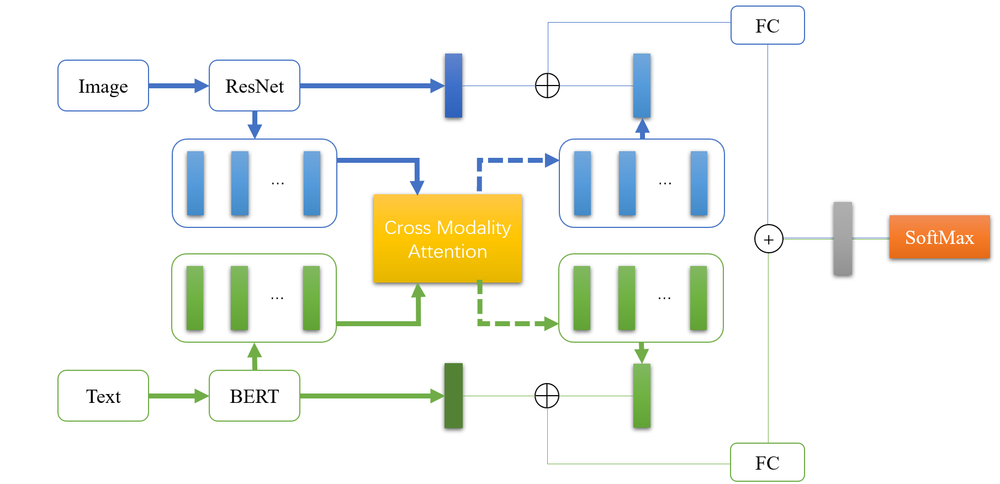
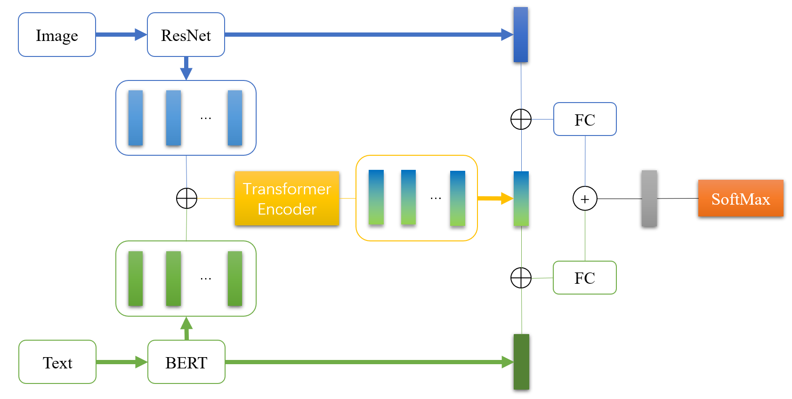
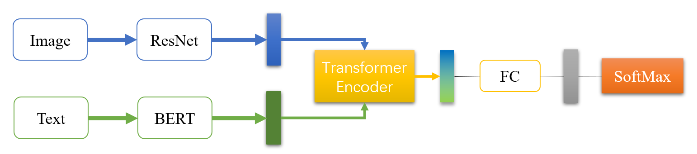

# Multimodal-Sentiment-Analysis
多模态情感分析——基于BERT+ResNet50的多种融合方法，数据学院人工智能课程第五次实验代码

本项目基于Hugging Face和torchvision实现，共有五种融合方法（2Naive 3Attention），在Models文件夹中查看

## Project Structure

```
|-- Multimodal-Sentiment-Analysis
    |-- Config.py
    |-- main.py
    |-- README.md
    |-- requirements.txt
    |-- Trainer.py
    |-- data
    |   |-- .DS_Store
    |   |-- test.json
    |   |-- test_without_label.txt
    |   |-- train.json
    |   |-- train.txt
    |   |-- data
    |-- Models
    |   |-- CMACModel.py
    |   |-- HSTECModel.py
    |   |-- NaiveCatModel.py
    |   |-- NaiveCombineModel.py
    |   |-- OTEModel.py
    |   |-- __init__.py
    |-- src
    |   |-- CrossModalityAttentionCombineModel.png
    |   |-- HiddenStateTransformerEncoderCombineModel.png
    |   |-- OutputTransformerEncoderModel.png
    |-- utils
        |-- common.py
        |-- DataProcess.py
        |-- __init__.py
        |-- APIs
        |   |-- APIDataset.py
        |   |-- APIDecode.py
        |   |-- APIEncode.py
        |   |-- APIMetric.py
        |   |-- __init__.py
```

## Requirements

chardet==4.0.0
numpy==1.22.2
Pillow==9.2.0
scikit_learn==1.1.1
torch==1.8.2
torchvision==0.9.2
tqdm==4.63.0
transformers==4.18.0

```shell
pip install -r requirements.txt
```

## Model

两个Naive方法就不展示了

**CrossModalityAttentionCombine**




**HiddenStateTransformerEncoder**



**OutputTransformerEncoder**



## Train

需下载数据集，并放在data文件夹中解压，数据集地址：链接: https://pan.baidu.com/s/10fOExXqSCS4NmIjfsfuo9w?pwd=gqzm 提取码: gqzm 复制这段内容后打开百度网盘手机App，操作更方便哦

```shell
python main.py --do_train --epoch 10 --text_pretrained_model roberta-base --fuse_model_type OTE 单模态(--text_only --img_only)
```

fuse_model_type可选：CMAC、HSTEC、OTE、NaiveCat、NaiveCombine

text_pretrain_model可在Hugging Face上选择合适的

## Test

```shell
python main.py --do_test --text_pretrained_model roberta-base --fuse_model_type OTE --load_model_path $your_model_path$ 单模态(--text_only --img_only)
```

## Config

```python
class config:
    # 根目录
    root_path = os.getcwd()
    data_dir = os.path.join(root_path, './data/data/')
    train_data_path = os.path.join(root_path, 'data/train.json')
    test_data_path = os.path.join(root_path, 'data/test.json')
    output_path = os.path.join(root_path, 'output')
    output_test_path = os.path.join(output_path, 'test.txt')
    load_model_path = None

    # 一般超参
    epoch = 20
    learning_rate = 3e-5
    weight_decay = 0
    num_labels = 3
    loss_weight = [1.68, 9.3, 3.36]

    # Fuse相关
    fuse_model_type = 'NaiveCombine'
    only = None
    middle_hidden_size = 64
    attention_nhead = 8
    attention_dropout = 0.4
    fuse_dropout = 0.5
    out_hidden_size = 128

    # BERT相关
    fixed_text_model_params = False
    bert_name = 'roberta-base'
    bert_learning_rate = 5e-6
    bert_dropout = 0.2

    # ResNet相关
    fixed_img_model_params = False
    image_size = 224
    fixed_image_model_params = True
    resnet_learning_rate = 5e-6
    resnet_dropout = 0.2
    img_hidden_seq = 64


    # Dataloader params
    checkout_params = {'batch_size': 4, 'shuffle': False}
    train_params = {'batch_size': 16, 'shuffle': True, 'num_workers': 2}
    val_params = {'batch_size': 16, 'shuffle': False, 'num_workers': 2}
    test_params =  {'batch_size': 8, 'shuffle': False, 'num_workers': 2}

```


## Result

| Model                         | Acc        |
| ----------------------------- | ---------- |
| NaiveCat                      | 71.25      |
| NaiveCombine                  | 73.625     |
| CrossModalityAttentionCombine | 67.1875    |
| HiddenStateTransformerEncoder | 73.125     |
| **OutputTransformerEncoder**  | **74.625** |

#### 消融实验

OutputTransformerEncoderModel Result：（另一模态输入文本为空字符串或空白图片）

| Feature    | Acc    |
| ---------- | ------ |
| Text Only  | 71.875 |
| Image Only | 63     |

## Reference

Joint Fine-Tuning for Multimodal Sentiment Analysis：[guitld/Transfer-Learning-with-Joint-Fine-Tuning-for-Multimodal-Sentiment-Analysis: This is the code for the Paper "Guilherme L. Toledo, Ricardo M. Marcacini: Transfer Learning with Joint Fine-Tuning for Multimodal Sentiment Analysis (LXAI Research Workshop at ICML 2022)". (github.com)](https://github.com/guitld/Transfer-Learning-with-Joint-Fine-Tuning-for-Multimodal-Sentiment-Analysis)

Is cross-attention preferable to self-attention for multi-modal emotion recognition：[smartcameras/SelfCrossAttn: PyTorch implementation of the models described in the IEEE ICASSP 2022 paper "Is cross-attention preferable to self-attention for multi-modal emotion recognition?" (github.com)](https://github.com/smartcameras/SelfCrossAttn)

Multimodal_Sentiment_Analysis_With_Image-Text_Interaction_Network：[Multimodal Sentiment Analysis With Image-Text Interaction Network | IEEE Journals & Magazine | IEEE Xplore](https://ieeexplore.ieee.org/abstract/document/9736584/)

CLMLF：[Link-Li/CLMLF (github.com)](https://github.com/Link-Li/CLMLF)
